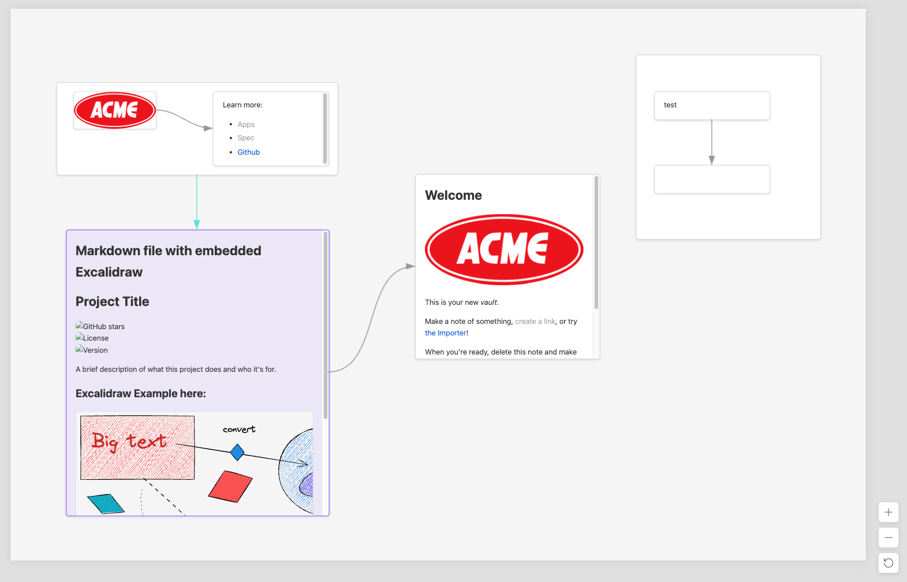
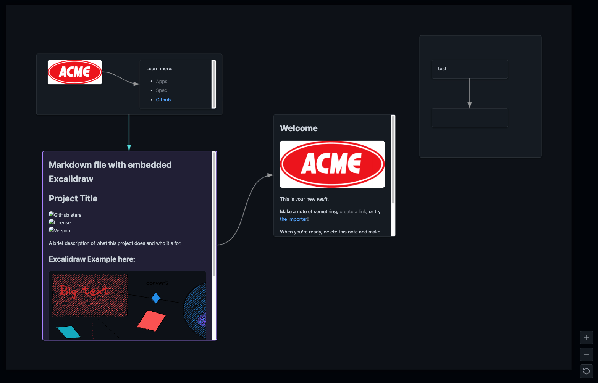
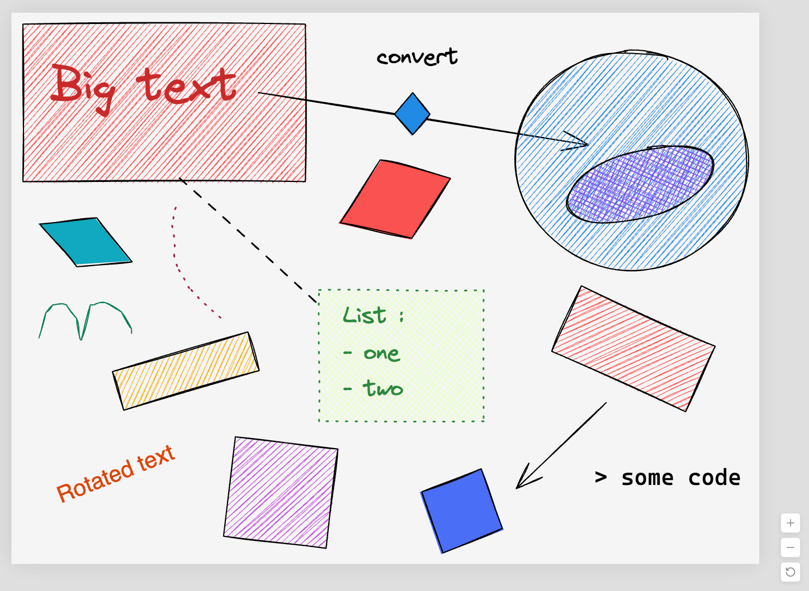
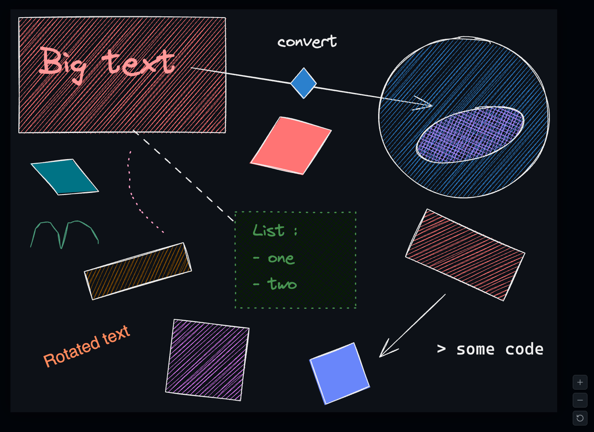
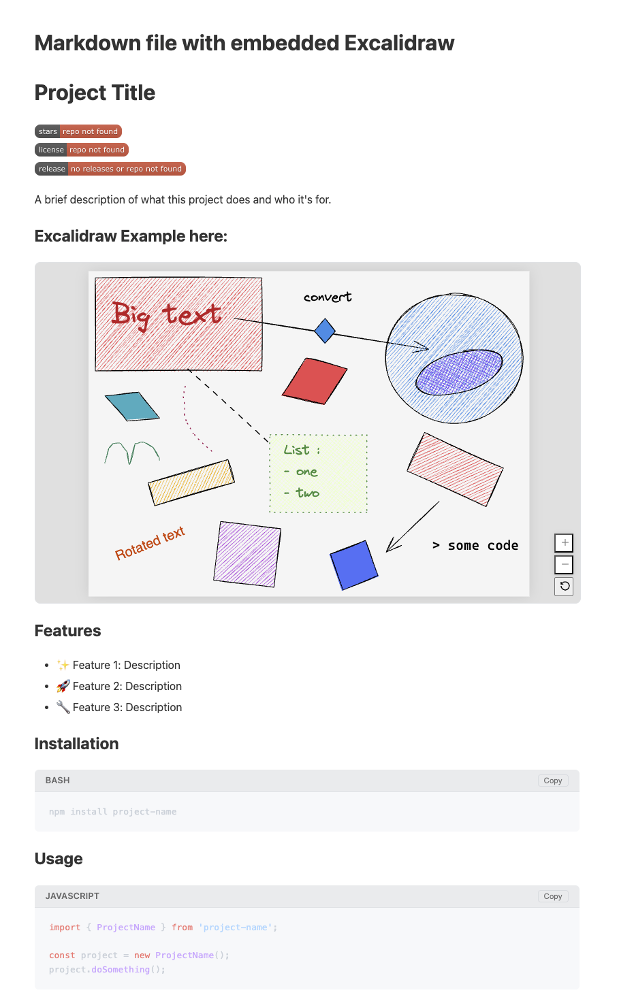
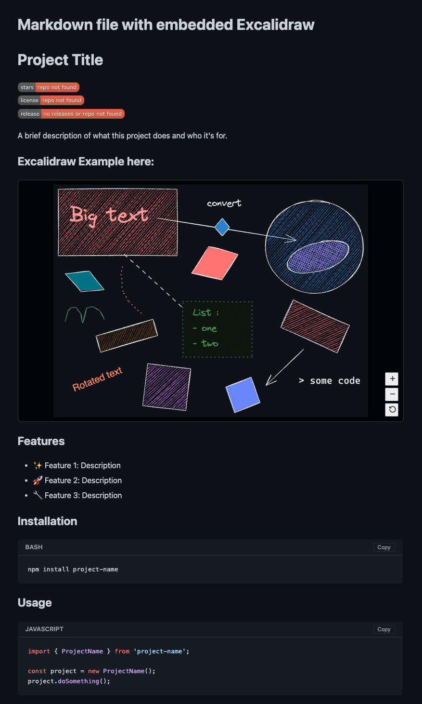

# Obsidian S3/MinIO Publisher

Publish your Obsidian notes, Canvas files, and Excalidraw drawings as beautiful, static HTML to any S3-compatible object storage (MinIO, AWS S3, DigitalOcean Spaces, Cloudflare R2).

## Features

- **🌐 Universal S3 Support**: Works with AWS S3, MinIO, Cloudflare R2, DigitalOcean Spaces, and more.
- **🎨 Infinite Canvas Publishing**: Full support for Obsidian Canvas.
  - Renders nodes, edges, groups, and colors.
  - **Interactive**: Pan, zoom-to-cursor, and drag support natively.
  - **Embedded Content**: Supports images, Excalidraw embeddings, and nested Markdown files within Canvas.
- **✏️ Excalidraw Support**:
  - **Full-Page View**: Publish Excalidraw files as zoomable, pannable interactive pages.
  - **Interactive Embeds**: Use `![[drawing.excalidraw]]` inside notes. Embeds are **fully interactive** (pan/zoom) and responsive.
  - **Smart Rendering**: Automatically handles light/dark mode transparency and embedded images.
- **📝 Rich Markdown Rendering**:
  - **Full Syntax Support**: GitHub Flavored Markdown (GFM), including task lists, standard tables, and Obsidian callouts.
  - **Images & Media**: Automatically uploads local images, video (`.mp4`, `.webm`, etc.), audio (`.mp3`, `.wav`), PDF embeds, and attachments.
  - **Embeds**: Recursively resolves and includes `![[Note]]` embeds.
  - **Table of Contents (TOC)**: Automatically generates a dynamic, sticky table of contents based on headings. Active headings are highlighted as you scroll.
  - **Hover Previews (Popovers)**: Internal links show a Wikipedia-style loading popover preview of the linked note on hover.
  - **Code Blocks**: Syntax highlighting via `rehype-highlight` with integrated "Copy" buttons.
  - **Dark Mode**: Respects system preferences for light/dark themes natively via CSS variables.
- **🔐 Private Link Generation**: Generates obfuscated UUID paths (e.g., `.../share_id/index.html`) for secure sharing.
- **🔒 Secure Credentials**: Uses Obsidian's native, encrypted `SecretStorage` wrapper to keep your API Access and Secret keys safe from plain-text exposure in `data.json`.
- **🌳 Deep Recursive Publishing & Embeds**: Publish a note alongside all of its outgoing/incoming links and embedded content at once. Can symmetrically unpublish dependencies as well.
  - **Seamless Nesting**: Embed Excalidraw drawings and infinite Canvas files directly inside your Markdown format, or place Markdown notes and images inside a Canvas—everything renders interactively and perfectly!
  - **Universal Dark/Light Mode**: No matter how deeply you nest your files, every embedded component (Canvas, Excalidraw, Markdown) natively supports and dynamically switches between light and dark modes based on system preferences.

## Screenshots

### 1. Published Canvas

_A complex Obsidian Canvas rendered with full interactivity and styling._

### 2. Interactive Excalidraw Embed

_Excalidraw drawings embedded in notes retain full pan/zoom capabilities w/ responsive scaling._

### 3. Published Note

_Clean, readable Markdown rendering complete with Table of Contents, Code highlighting, and Dark Mode._

## Installation

1. Install the **Obsidian S3 Publisher** plugin (Marketplace or Manual).
2. Enable the plugin in settings.

## Configuration

Navigate to **Settings > S3 Publisher** to configure your provider.

| Setting        | Description                                                                                                                   |
| :------------- | :---------------------------------------------------------------------------------------------------------------------------- |
| **Endpoint**   | Your S3 API URL (e.g., `https://s3.amazonaws.com` or `http://localhost:9000`)                                                 |
| **Region**     | Bucket region (e.g., `us-east-1` or `auto` for some providers)                                                                |
| **Bucket**     | The name of your bucket (must store content publicly or generate presigned URLs - this plugin uses public read ACL currently) |
| **Access Key** | Your S3 Access Key ID                                                                                                         |
| **Secret Key** | Your S3 Secret Access Key                                                                                                     |
| **Public URL** | (Optional) Custom domain for sharing links (e.g., `https://notes.mysite.com`)                                                 |

> **Tip**: Use the **"Test Connection"** button to verify your settings before publishing!

## Usage

### Publishing

1. Open a **Note (.md)**, **Canvas (.canvas)**, or **Excalidraw** file.
2. Open Command Palette (\`Cmd/Ctrl+P\`) -> \`S3 Publisher: Publish\`.
3. **Or** Right-click the file in the explorer -> \`S3: Publish Note\` (or \`Update published note\`).
4. **Recursive**: Right-click -> \`S3: Publish Recursively\` to intelligently publish the current file along with all directly linked files, embeds, and background banners.
5. Wait for the "Published!" toast. The link is copied to your clipboard.

### Managing Files

- **View Online**: Right-click a published file -> \`S3: View Online\`.
- **Unpublish**: Right-click -> \`S3: Unpublish Note\` to remove it from the server.
- **Recursive Unpublish**: Right-click -> \`S3: Unpublish Recursively\` to cleanly unpublish a note and all of its connected published dependencies from S3.
- **Settings**: Go to the **Published Files** tab in settings to see a full list of all active shares. You can click **Refresh Index** to continuously scan your vault and restore your published file list if you switch devices or migrate vaults. Published files are also visually annotated with an icon in your file explorer.

## Advanced

### Modular Compiler System

The plugin features a robust, extensible compiler architecture centered around a `CompilerRegistry`. This allows different file types to be processed by dedicated rendering engines. It is designed to be highly modular, making it easy to add support for additional file types or custom Obsidian plugins (such as Dataview, Kanban, or excalidraw-like boards) in the future.

#### Unified Markdown Compiler

The plugin leverages the `unified`, `remark`, and `rehype` ecosystem to produce precise HTML output matching standard specifications. It intercepts wikilinks, transforms embedded images, handles rich media types natively (audio, video, PDFs), and resolves custom Obsidian formatting.

#### Canvas & Excalidraw Compilers

The plugin includes custom compilers for visual formats:

- **Canvas**: Converts JSON -> Interactive HTML5/SVG with Cubic Bézier curves.
- **Excalidraw**: Uses lightweight wrappers to render compressed Excalidraw JSON -> SVG.
- **Zero Runtime Dependencies**: The generated HTML is standalone; it does **not** fetch large JS bundles from CDNs.

### Styling

Styles are injected automatically without requiring external CSS files.

- **Markdown**: Uses clean typography inheriting standard UI paradigms.
- **Colors**: Mapped to standard Obsidian colors.
- **Tags**: Renders \`#tags\` with pill styling.

---

_Built for the Obsidian Community._
